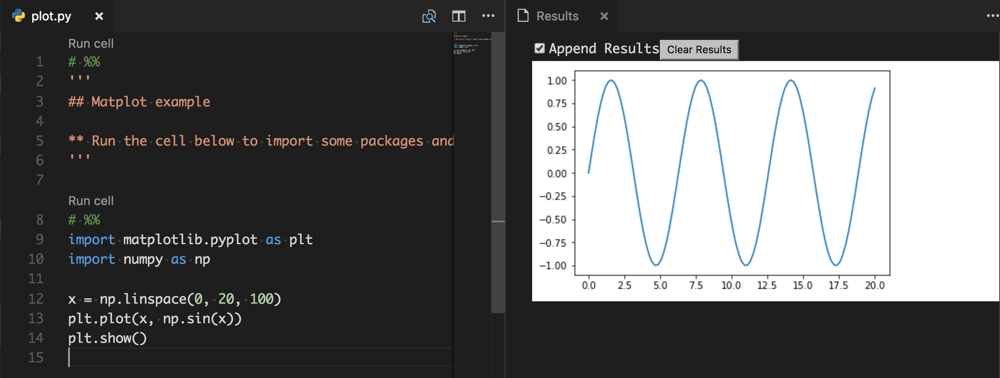

# ipynb-py-convert

Atom/Hydrogen or VSCode/Python allows creating a python files split into cells with `# %%` separators with the ability to run cells via backend Jupyter session and interactively show results back.

More examples: [Jupyter Python VSCode examples](https://github.com/DonJayamanne/pythonVSCode/wiki/Jupyter-Examples), [Atom/Hydrogen Getting Started](https://nteract.gitbooks.io/hydrogen/docs/Usage/GettingStarted.html).

[ipynb-py-convert](https://pypi.python.org/pypi/ipynb-py-convert) python module converts files: .ipynb to .py and .py to .ipynb.

**ipynb-py-convert** is a forks of the [vscode-ipynb-py-converter](https://github.com/nojvek/vscode-ipynb-py-converter).


## Install

```bash
conda install -c defaults -c conda-forge ipynb-py-convert
```
or
```bash
pip install ipynb-py-convert
```


## Example

`ipynb-py-convert examples/plot.py examples/plot.ipynb`

or

`ipynb-py-convert examples/plot.ipynb examples/plot.py`


**VSCode**



Markdown cells are converted to python multiline strings `'''`. Code cells are left as is. `# %%` is used by vscode as the cell marker on which 'Run Cell' action is available.


**Jupyter ipynb notebook**


